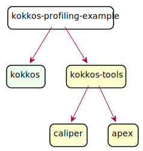

## Kokkos Profiling Example

This example demonstrates the idea of connecting Kokkos profiling tools directly in the application (instead of traditional `` approach):
```cpp
int main(int argc, char *argv[]) {

  auto eventSet = KokkosTools::activate_tool("caliper",
                                             "runtime-report(profile.kokkos)");
  Kokkos::Tools::Experimental::set_callbacks(eventSet);

  Kokkos::initialize(argc, argv);
  // ... run app ... //
  Kokkos::finalize();
  return 0;
}
```

### How to build

```shell
$ git clone --recursive git@github.com:MikolajZuzek/kokkos-profiling-example.git

$ cd kokkos-profiling-example
$ cmake -B build -S .
$ cmake --build build -j
```

### How to run

```shell
$ cd kokkos-profiling-example
$ ./build/profiling_sample_app

Result OK: S(2000) = 2001000

Path                                             Time (E) Time (I) Time % (E) Time % (I)
HostSpace::impl_deallocate before free           0.000008 0.000008   0.876232   0.876232
Computation                                      0.000089 0.000229   9.748083  25.082147
  Kokkos::parallel_reduc~~ being value, not view 0.000005 0.000005   0.547645   0.547645
  accumulate()                                   0.000031 0.000037   3.395400   4.052574
    Kokkos::Tools::invoke~~os Profile Tool Fence 0.000006 0.000006   0.657174   0.657174
  Kokkos::fence: Unnamed Global Fence            0.000012 0.000012   1.314348   1.314348
  initialize()                                   0.000055 0.000062   6.024096   6.790800
    Kokkos::Tools::invoke~~os Profile Tool Fence 0.000007 0.000007   0.766703   0.766703
  Kokkos::Tools::invoke_~~kos Profile Tool Fence 0.000024 0.000024   2.628697   2.628697
Kokkos::Tools::invoke_k~~kkos Profile Tool Fence 0.000043 0.000043   4.709748   4.709748
```

### Git modules

<div align="center">



</div>

Modules:
* _kokkos-profiling-example_: [this repository](https://github.com/MikolajZuzek/kokkos-profiling-example)
* _kokkos_: `develop` branch of [Kokkos](https://github.com/kokkos/kokkos) forked at [NGA](https://github.com/NexGenAnalytics/kokkos)
* _kokkos-tools_: `cmake-build-system` WIP branch of [KokkosTools](https://github.com/kokkos/kokkos-tools) forked at [NGA](https://github.com/NexGenAnalytics/kokkos-tools)
* _caliper_: `feature/make-multitool-safe` WIP branch of [Caliper](https://github.com/LLNL/Caliper) forked at [NGA](https://github.com/NexGenAnalytics/Caliper)
* _apex_: `develop` branch in [Apex](https://github.com/UO-OACISS/apex) forked at [NGA](https://github.com/NexGenAnalytics/apex)

> *Note:* Work in progress is presented here, based on draft PRs.
